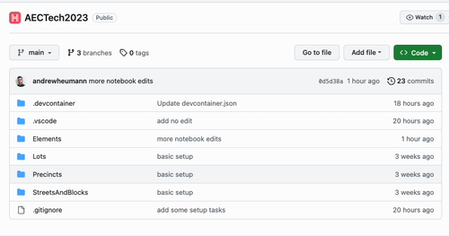
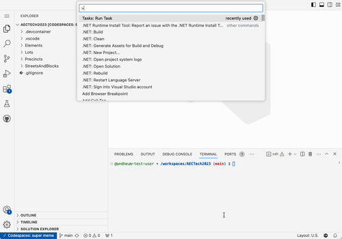

# Hypar Masterclass @ AEC Tech 2023

## Introduction
To use this repository, sign in with your github account, and create a codespace by clicking the green button above. This will create a virtual machine in the cloud with all the software you need to run the examples in this repository.

## Getting Started

Once your codespace is ready, use ctrl+shift+p (or cmd+shift+p) to open the command palette. Search for "Run Task" and choose "Tasks: Run Task." Select "Sign in to Hypar."
You will see a sign in link in the console at the bottom of the screen — go to this link and sign in with your Hypar account. Once you have signed in, you can close the Hypar tab and return to the codespace.

## About this repository

There are two primary directories:

### `/Elements`

Contains a set of .NET interactive notebooks to teach you about the Hypar Elements library.

### `/ExampleFunctions`

Contains a set of example Hypar Functions that you can modify or refer to as you build your own functions. (Note that if you want to publish your own version of these functions, you'll need to change the `id` value in `hypar.json`.)